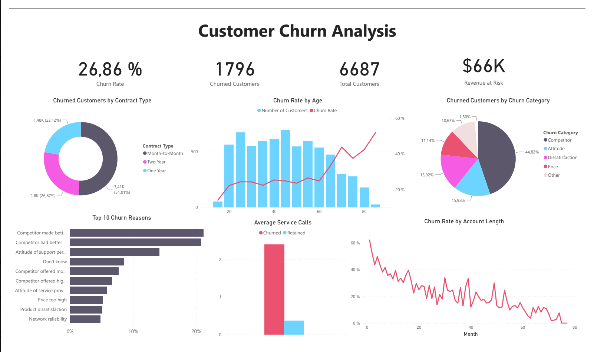

# Customer-Churn-Analysis-Power-BI

## Overview

A Power BI case study focused on analyzing customer churn and identifying patterns across customer segments, contract types, payment methods, customer behavior, and churn reasons.

The analysis explores the overall churn rate and how it varies across different customer characteristics.

## Key Metrics

- Churn Rate: 26.86%
- Churned Customers: 1,796
- Total Customers: 6,687
- Revenue at Risk: $66K

## Analysis

The dashboard explores:

- Churn reasons and categories
- Customer churn by contract type
- Churn by contract category and gender
- Churn by account length
- Churn by payment method
- Churn by age
- Churn by grouped consumption and unlimited data plan
- Customer service calls and churn
- Monthly charge and churn rate

## Dashboard

The dashboard provides an overview of customer churn and explores churn patterns across contracts, customer demographics, account length, service usage, and churn reasons.

## Key Findings

- The overall customer churn rate is 26.86%.
- Month-to-month customers represent 51.01% of the customer base.
- Monthly contract customers have a 46.29% churn rate, compared with 6.62% for yearly contracts.
- Competitor-related reasons account for the largest share of churn categories at 44.82%.

## Data

The project uses a customer churn dataset from a DataCamp case study containing 6,687 customer records.

The dataset includes customer demographics, contract and payment information, account length, service usage, charges, customer service interactions, and churn information.

The analysis focuses on identifying patterns in customer churn across different customer characteristics and service-related factors.

**Source:** [DataCamp — Customer Churn Analysis](Churn%20Analysis%20Data.csv)

## Tools & Skills

- Power BI
- DAX
- Power Query
- Data Modeling
- Data Transformation
- Data Visualization
- KPI Development
- Interactive Analysis

